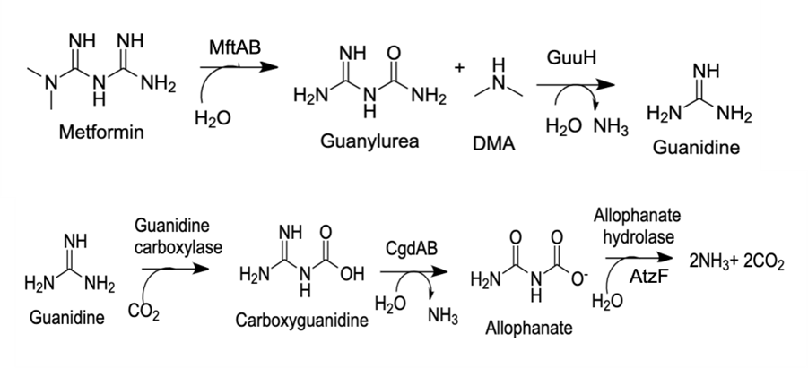
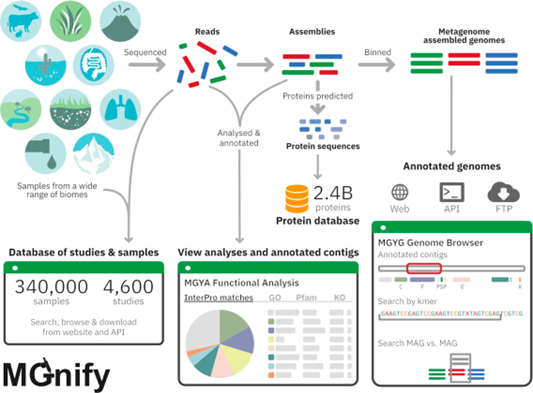
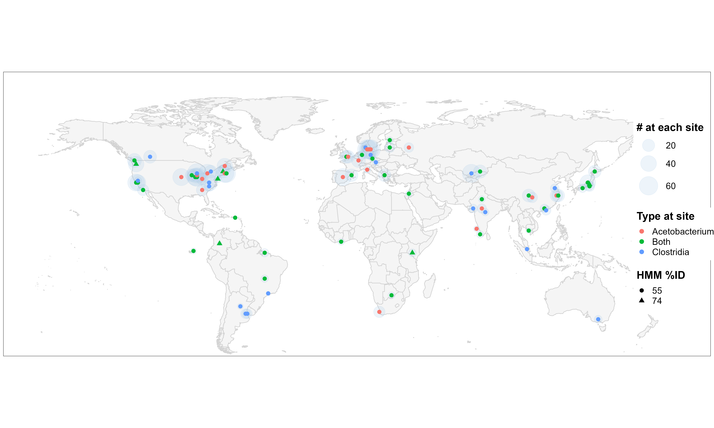

# Class Assignment BICB 5309

## Goals and Background:
*By the end of this exercise, students will be able to:*

- Define the term "bioremediation.” 
- Compare and contrast microbiomes, genomes, and metagenomes
- Explain the pathway involved in microbial degradation of Metformin
- Analyze recent research literature to investigate the enzymes and transporters involved in microbial Metformin degradation
- Search a general bioinformatics database (BLAST) to identify proteins that are homologous to the ones involved in Metformin metabolism
- Discuss how the information found in microbiomes and metagenomes can be used to develop biotechnological applications for wastewater treatment
- Collaborate with students at a partner institution to propose a wastewater treatment application involving microbiomes and metagenomics information


Metformin is the most commonly prescribed drug in the United States and around the world for the treatment of type II diabetes. Besides its glucose-lowering capabilities, Metformin has also been reported to be effective for treating other conditions such as polycystic ovarian syndrome and obesity. Metformin has recently been shown to alleviate symptoms and improve treatment outcomes in COVID-19 patients.
 
Metformin cannot be completely metabolized by patients, and its residues cannot be removed by wastewater treatment plants.  Given Metformin’s widespread use, this drug, and its main degradation product, guanylurea, are among the most common anthropogenic pollutants found in surface waters and wastewater treatment plants. Several research groups have recently investigated the microbial degradation of Metformin as an alternative to removing the drug from surface waters and wastewater treatment facilities. Evidence from genomic and biochemical studies led to the development of a proposed Metformin degradation pathway, which is depicted below (Figure 1).


***Figure 1.** Proposed pathway for the microbial degradation of Metformin.*

The pathway for the microbial degradation of Metformin was only recently discovered. The genes encoding the enzymes necessary for the degradation of this pharmaceutical were found in bacteria from a wastewater treatment plant in Minnesota. Shortly after, researchers reported finding similar bacteria in France and China. Metformin has also been detected in rivers across the world. These observations suggest that Metformin-degrading bacteria might be widespread in freshwater as well as wastewater treatment facilities worldwide. Therefore, more research needs to be done to investigate the presence of gene-encoding metfomin-degrading enzymes in wastewater and other environments. You are tasked with answering whether or not Metformin is being degraded in waste water treatment plants.

Modern DNA sequencing technology and bioinformatics resources provide a unique opportunity to explore the presence of genes and proteins in metagenomes from different environments. MGnify is a database of metagenomes that represent multiple environments, including water, soil, plants, wastewater, etc. (Richardson, 2023) (Figure 2).  This database is an excellent resource for investigating the presence of genes encoding enzymes involved in the Metformin degradation pathway in currently available metagenomes.  

***Figure 2:** Diagram showing the information and workflow that allowed the creation and utilization of MGnify to search metagenomes from different environments.*

The goal of this activity is to search a custom database called BioMGnify, which contains metagenomes from wastewater treatment plants across the world (Figure 3). You will recieve a list of proteins of interest which are involved in the degredation of Metformin. You will BLAST these proteins against a database from MGnify.  Using your blast search you will interface an Rscript designed to map the presence and coocurrence of genes in metagenomes.


***Figure 3:** Presence of CarC homologs in WWTPs globally. The MGnify database was searched with Hidden Markov Models (HMMs) as described in the Methods section and generated using seed caffeoyl-CoA reductase (CarC) homologs from Acetobacterium and Clostridium. The search retrieved 723 metagenomes of which 499 had sufficient location metadata to plot the locations of the WWTP. In most instances, multiple metagenomic sequences were identified at a given site and the number is represented by the size of the blue circle. Some sites contained only Acetobacterium-type sequences, others only Clostridium type, and most contained both. Seven different WWTPs, shown as triangles, had a sample(s) that was identified with a higher confidence HMM (74% vs. 55%).*

Figure 3 is an example of when I used this script in a paper to identify carC genes using the same database. *Acetobacterium* and *Clostridia* species are able to utilize the carC gene to reduce carbon-carbon bonds containing fluorine leading to the elimination of fluoride. This tool allowed us to suggest that reduction of fluorinated chemicals might already be happening globally through homologous proteins.

## Background Information on Metformin 

Background information DOI: 

- Tassoulas, L. J., Rankin, J. A., Elias, M. H., & Wackett, L. P. (2024). Dinickel enzyme evolved to metabolize the pharmaceutical Metformin and its implications for wastewater and human microbiomes. Proceedings of the National Academy of Sciences, 121(10), e2312652121. | https://doi.org/10.1073/pnas.2312652121
- Martinez-Vaz, et al.: Wastewater bacteria remediating the pharmaceutical Metformin: Genomes, plasmids and products. Front. Bioeng. Biotechnol., 16 December 2022 Sec. Bioprocess Engineering Volume 10 - 2022 | https://doi.org/10.3389/fbioe.2022.1086261
- Dong, L., Li, S., Huang, J., Li, W. J., & Ali, M. (2024). Co-occurrence, toxicity, and biotransformation pathways of Metformin and its intermediate product guanylurea: Current state and future prospects for enhanced biodegradation strategy. The Science of the total environment, 921, 171108. | https://doi.org/0.1016/j.scitotenv.2024.171108

## Explore Jupyter Notebook

Cal will present on screen the basics of jupyter notebook.  [Open your jupyter notebook here.](https://www.msi.umn.edu/support/faq/how-do-i-get-started-jupyter-notebooks)
We are going to be using Jupyter notebooks.  *This interactive computing environment requires only a web browser, and enables data analysis and visualization on our HPC resources in a shareable, reproducible notebook format.*  

This means that we are going to be working in a non local computing environment, and we will need to transfer our output files to our local computers.  We will use WINSCP or Filezilla depending on your OS.  By next class period, download and [configure WinSCP](https://www.msi.umn.edu/support/faq/how-do-i-use-winscp-transfer-data)  for Windows users and [FileZilla](https://www.msi.umn.edu/support/faq/how-do-i-use-filezilla-transfer-data) for Mac users.

## Setting up

The databases, R packages, and scripts are all already installed on this MSI environment and shared in the public folder. You will just need to copy a few of these files and set up a directory.

```bash
# This is a comment line.  Comment lines begin with a "#". It shouldn't be a problem if they are in your code, because bash (the language we are coding in) ignores them.

# Create a conda environment to run BLAST searches and to synergize with our R packages
# Create conda environment from the file in the public directory.
module load conda 
conda env create -f ~/../public/mgmap.yml
conda deactivate
conda activate mgmap

# If those last two lines do not work.  Run the following line to initialize conda.
conda init bash

# Then restart your Jupyter Notebook by starting and stopping your server through the Hub Control Pannel under 'File'.
```

Create some directories that our R file will recognize. Run the following code in your terminal.

```bash
#mkdir makes a directory/folder
mkdir mgmap
# cd changes your current directory
cd mgmap
# ls lists all files and diretories in your current directory
ls
mkdir input
mkdir output
```

Now we have all of the required directories. We are going to copy a few of the scripts. You will edit these scripts, so copy and don't move them!

```bash
cd ~/mgmap
cp ~/../public/Mgnify_search_fv.R
cp ~/../public/run_Mgnify_search_map.txt
cp ~/../public/blast_combo_search.txt
```

## Section for FASTA FILES AND BLAST

We are going to run our BLAST searches in a batch format.  We are going to use SLURM to do this. SLURM is a type of script that requests resources from a larger computer and runs a script independent of your terminal. You will add your fasta files to a folder and then edit a template to run a BLAST search against a wastewater protein database in the public folder of the class's shared directory.  The database was created by MGnify and modified to be BLAST compatible.

A fasta file is a file format containing nucleotide or protein data.  They begin with an annotation line containing ">" as the first character.  FASTA files may contain more than one sequence as long as they are seperated by a *\n* and an additional annotation line. The file extension is often abreviated to identify if the file contains the nucleic acid sequence *.fna* or the amino acid sequence *.faa*.  Our collaborators from Hamline provided us with sequences in a *.txt* format.  Even though the extension is not a fasta extension, the format of the files is still fasta and thus will be refered to as fasta files.

> Note on fasta files.  Metforminase was formerly known as gbuAB.  The fasta files use this name.  At some point rename this to MftAB

### Example

\>crab_anapl ALPHA CRYSTALLIN B CHAIN (ALPHA(B)-CRYSTALLIN).             
MDITIHNPLIRRPLFSWLAPSRIFDQIFGEHLQESELLPASPSLSPFLMRSPIFRMPSWLETGLSEMRLEKDKFSVNLDVKHFSPEELKVKVLGDMVEIHGKHEERQDEHGFIAREFNRKYRIPADVDPLTITSSLSLDGVLTVSAPRKQSDVPERSIPITREEKPAIAGAQRK\
\>crab_bovin ALPHA CRYSTALLIN B CHAIN (ALPHA(B)-CRYSTALLIN).             
MDIAIHHPWIRRPFFPFHSPSRLFDQFFGEHLLESDLFPASTSLSPFYLRPPSFLRAPSWIDTGLSEMRLEKDRFSVNLDVKHFSPEELKVKVLGDVIEVHGKHEERQDEHGFISREFHRKYRIPADVDPLAITSSLSSDGVLTVNGPRKQASGPERTIPITREEKPAVTAAPKK\
\>crab_chick ALPHA CRYSTALLIN B CHAIN (ALPHA(B)-CRYSTALLIN).             
MDITIHNPLVRRPLFSWLTPSRIFDQIFGEHLQESELLPTSPSLSPFLMRSPFFRMPSWLETGLSEMRLEKDKFSVNLDVKHFSPEELKVKVLGDMIEIHGKHEERQDEHGFIAREFSRKYRIPADVDPLTITSSLSLDGVLTVSAPRKQSDVPERSIPITREEKPAIAGSQRK

### Batch Search

```bash
cd ~/mgmap # move to mgmap folder
wget
```

Add the following line to the *blast_combo_search.txt* file and also add your email to the parameters where prompted.

```bash
blastp -query fasta_files/FILE.faa -db ~/../public/ww_proteins.faa -outfmt 6 -max_target_seqs num_sequences > /input/protname_ww_blast.out
# enter the max number of sequences you wish to retrieve: num_sequences
# enter the fasta file: file.faa
# change the name of your output file: protname_ww_blast.out
# EXAMPLE:
# blastp -query fasta_files/MYFASTAFILE.faa -db ~/../public/ww_proteins.faa -outfmt 6 -max_target_seqs 200 > /input/MYOUTPUTFILENAME.out
```

After editing your SLURM script, call Cal over to verify that everything looks right.  Then, run it using the following command.

```bash
sbatch -p large blast_combo_search.txt
```

## Run the mgmap sequence

Create a [geonames](http://www.geonames.org/) account and add it to the user parameters!
After confirming your account you need to allow access to the [geonames webservices](http://www.geonames.org/enablefreewebservice).

Open the Mgnify_search_fv.R file and change the following variables to match your search.

1. geonamesUsername
2. pid_cutoff
3. BLAST_search
4. prot_names
5. thresh (optional)

Again we are going to run this script via SLURM.  In the future you could set up one script to run your blast searches and run the Rscript. You will also need to add your email to the run_Mgnify_search_map.txt script.

```bash
sbatch -p large run_Mgnify_search_map.txt
```

## Assignment questions

After completing the computational part of the assignment, save the map files and the metadata to your local computer using WINSCP or FILEZILLA. You will need this to prepare a presentation that you will share with your collaborators at Hamline University. They have used the same tools to look for genes involved in the degradation of Metformin.  Your presentation should have 4-6 slides addressing the questions below.  The slides should at some point answer **all** of the questions below.  You may include the answer to the question in the presenter notes, but the slide must add or illustrate your point. You can use the papers discussed in class as references to support your answers.

To submit your assignment you will submit your slides to canvas and answer the individual questions seperately. **Even if you have answered the questions in your slides, submit your questions as a seperate document.** *You recieve 1.5 pts for your slides being complete, coherent, and having proper flow.*


### 1. General search info (0.5 pts)

Which Metformin degradation genes did you look for in your BLAST searches? What were the percent identity cutoffs used for the search?

### 2. The Metformin Breakdown Pathway (1 pt)
What is the function of the proteins encoded by the genes selected for your blast searches? Briefly describe what they do in the Metformin degradation pathway 
(enzymes, transporters, etc.)

### 3. Search Results (0.5 pts)

Where were the genes you searched for most prevalent? What does the prevalence of the genes you investigated suggest about the consumption of Metformin and other biguanides? 

### 4. Where are waste water genes over time? (2.5 pts)

Look at the metadata file in the output. Where are genes located over time?  What does that say about Metformin?  

What trend would you expect with something like galegine or phenformin/buformin? Why?

### 5. Coocurrance (2.5 pts)

Did you observe co-occurence between the genes encoding the enzymes in the Metformin pathway? What does cooccurence of these genes suggest?  

Are the genes found on the map in the same organism?

If you found a crcB gene (a fluoride exporter) in a sample and a defluorinase gene at the same site, would the site be necessarily capable of defluorination?  Why or why not?

### 6. Applications (1.5 pts)
  
What types of functional genomic applications can be developed from the information found in MGnify database?

How would the applications discussed in question five be applied to improve wastewater treatment? 

